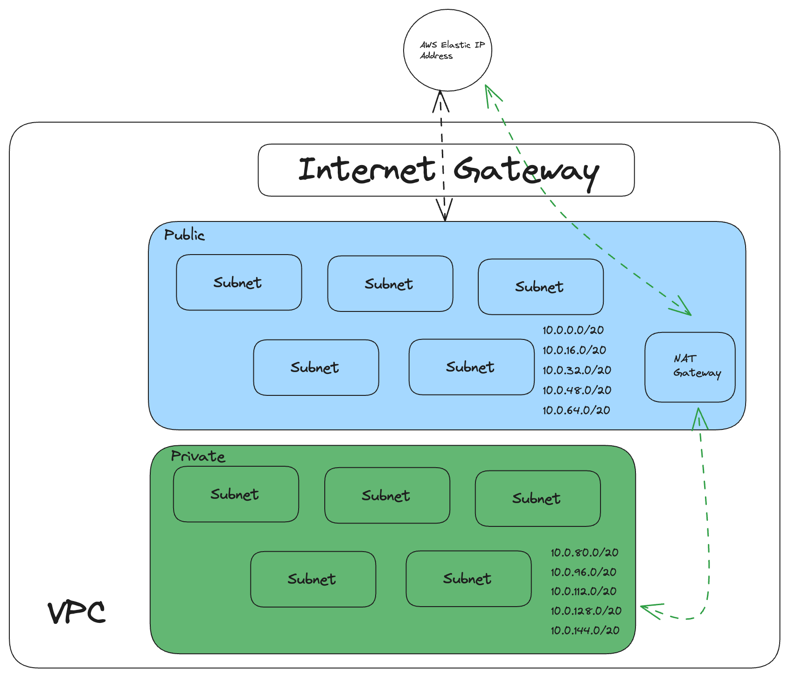

// example of markdown image 

# VPC 
1. VPC: Sets up a VPC with a CIDR block of 10.0.0.0/16.

# Internet gateway 
1. Internet Gateway: Attaches an internet gateway to the VPC for internet access.

2. Elastic IP and NAT Gateway: Creates an Elastic IP and a NAT Gateway within the first public subnet to allow internet access for the private subnets.

# Subnets
1. Public Subnets: Creates 5 public subnets and enables automatic public IP assignment.
2. Private Subnets: Creates 5 private subnets without public IP assignment.

# Route Tables
1. Routing for Public Subnets: Configures a route table for public subnets that routes all traffic to the internet gateway.

2. Routing for Private Subnets: Configures a route table for private subnets that routes all traffic to the NAT gateway.

3. Route Table Associations: Associates each subnet with its respective route table.

## Key take aways 

This setup ensures that all instances in the public subnets can receive public IPs and that instances in the private subnets can access the internet via the NAT gateway without having public IPs themselves.