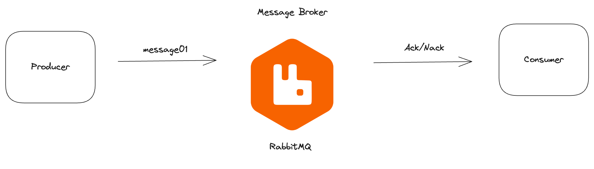

# example photo link md

1. **Message Broker Setup**: Set up a message broker such as RabbitMQ . This will act as an intermediary between your services.

2. **Service Implementation**:
   - **Producer Service**: This service will produce messages and send them to the message broker.
   - **Consumer Service**: This service will consume messages from the message broker and process them.

3. **Message Serialization**: Ensure that messages exchanged between services are serialized and deserialized properly. You can use popular formats like JSON or Protocol Buffers.

4. **Guaranteed Delivery**:
   - Configure the message broker to use acknowledgment mechanisms (ack/nack) to ensure that messages are only removed from the queue once they have been successfully processed by the consumer.
   - Implement retry logic in your consumer service to handle processing failures. If a message processing fails, it should be re-queued for later processing.

5. **Error Handling**:
   - Implement dead-letter queues in the message broker to handle messages that couldn't be processed after a certain number of retries. This allows you to investigate and manually handle failed messages.
   - Log errors and exceptions within your services for monitoring and troubleshooting purposes.

6. **Monitoring and Alerting**: Set up monitoring and alerting for your message broker and services to detect and respond to any issues or failures promptly.